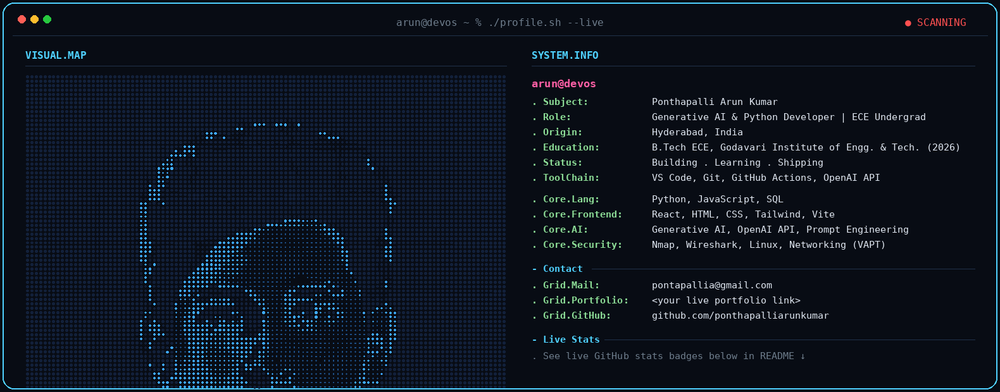

<h1>Ponthapalli Arun Kumar</h1>

 

  

 

### `>` Currently

- 🚀 Building and shipping my portfolio site — React, Vite, deployed via GitHub Actions
- 🧠 Learning advanced prompt engineering and multi-step LLM workflows
- 🤝 Open to collaborating on Generative AI projects, Python automation, and open-source
- 💬 Ask me about deploying my first CI/CD pipeline with GitHub Actions

 

### `>` Tech Stack

  

 

### `>` GitHub Stats

  
  

 

### `>` Activity Graph

  

### `>` Contribution Snake

<picture>
  <source media="(prefers-color-scheme: dark)" srcset="https://raw.githubusercontent.com/pontapallia/pontapallia/output/github-contribution-grid-snake-dark.svg" />
  <source media="(prefers-color-scheme: light)" srcset="https://raw.githubusercontent.com/pontapallia/pontapallia/output/github-contribution-grid-snake.svg" />
  
</picture>

  

### `>` Connect

  

© Ponthapalli Arun Kumar — Building with Generative AI.
